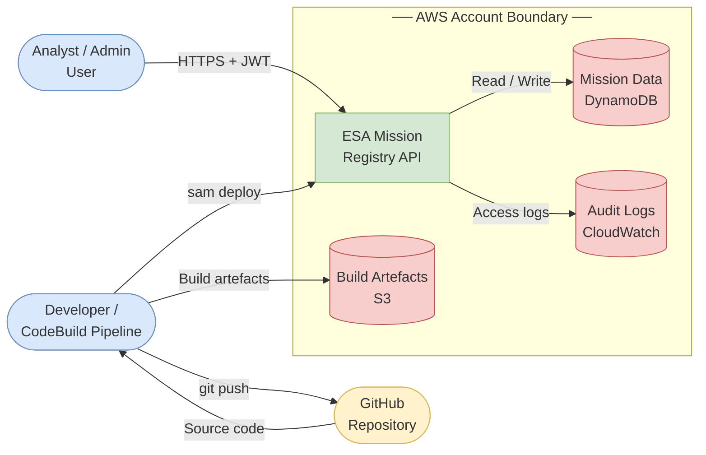
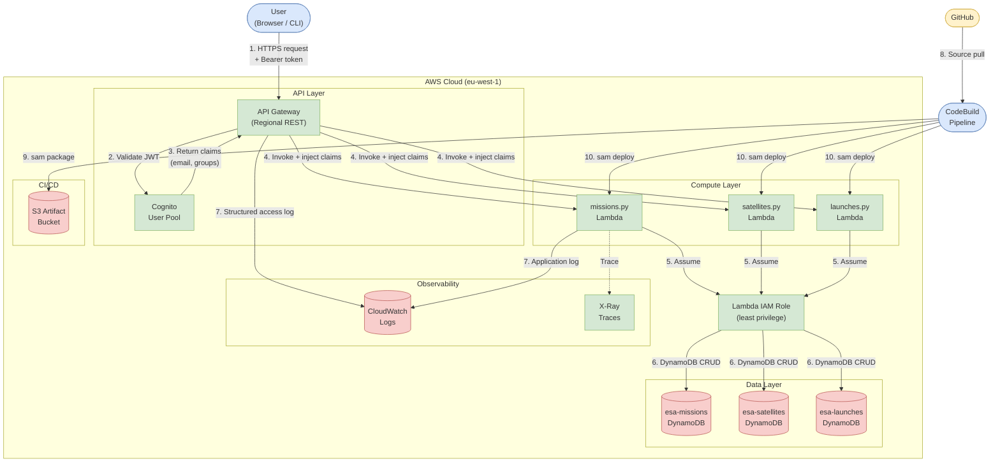

# STRIDE Analysis — 01: System Model

## Level 0 — Context Diagram

A high-level view showing the system as a single process and its external actors.

---

## Level 1 — Data Flow Diagram

An expanded view showing internal components, data flows, and where authentication occurs.

---

## Component Descriptions

| Component | Technology | Purpose |
|---|---|---|
| API Gateway | AWS REST API (Regional) | TLS termination, request routing, Cognito authorizer, throttling |
| Cognito User Pool | AWS Cognito | User authentication, JWT issuance, group-based RBAC |
| missions.py | Python 3.11 Lambda | CRUD for mission records; enforces admin-only writes |
| satellites.py | Python 3.11 Lambda | CRUD for satellite records |
| launches.py | Python 3.11 Lambda | CRUD for launch records |
| DynamoDB (×3) | AWS DynamoDB on-demand | Persistent storage; SSE enabled; PITR enabled |
| IAM Role | AWS IAM | Least-privilege role: only DynamoDB CRUD on named tables |
| CloudWatch Logs | AWS CloudWatch | API access logs + Lambda application logs; 90-day retention |
| X-Ray | AWS X-Ray | Distributed tracing for non-repudiation and performance |
| CodeBuild | AWS CodeBuild | CI/CD: test → SAST → package → deploy |
| S3 Artifact Bucket | AWS S3 | Encrypted artefact storage; public access blocked |

---

## Key Data Flows

| Flow ID | From | To | Data | Protocol |
|---|---|---|---|---|
| DF-01 | User | API Gateway | HTTP request + JWT | HTTPS |
| DF-02 | API Gateway | Cognito | JWT | Internal AWS |
| DF-03 | Cognito | API Gateway | Claims (email, groups) | Internal AWS |
| DF-04 | API Gateway | Lambda | Event + injected claims | Internal AWS |
| DF-05 | Lambda | DynamoDB | Mission/Satellite/Launch records | Internal AWS |
| DF-06 | API Gateway | CloudWatch | Access log entries | Internal AWS |
| DF-07 | Lambda | CloudWatch | Application logs | Internal AWS |
| DF-08 | CodeBuild | S3 | Packaged SAM template + code | Internal AWS |
| DF-09 | CodeBuild | Lambda | Deployed function code | Internal AWS |
| DF-10 | GitHub | CodeBuild | Source code via CodeConnections | HTTPS |
