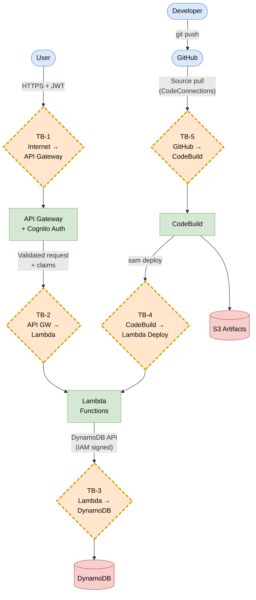

# STRIDE Analysis — 02: Trust Boundaries

Trust boundaries are points where data crosses from one security context to another.
They are where threat modelling focuses because they represent the highest risk —
an attacker who can influence data at a boundary may be able to affect the component
on the other side.

---

## Trust Boundary Diagram

---

## Trust Boundary Definitions

### TB-1 — Public Internet → API Gateway

| Attribute | Detail |
|---|---|
| **Crossing** | Any HTTP request from the internet reaching the API Gateway endpoint |
| **Trust change** | Untrusted (anonymous internet) → Partially trusted (TLS terminated, Cognito validated) |
| **Enforced by** | API Gateway + Cognito Authorizer |
| **What crosses** | JWT in `Authorization` header, request path, query params, request body |
| **Risk level** | 🔴 High — widest attack surface, accessible to the entire internet |

**Controls at this boundary:**
- Cognito authorizer rejects requests with missing, expired, or invalid JWTs
- TLS enforced (HTTP not available on API Gateway)
- API Gateway throttling: 20 req/s rate, 50 burst
- `PreventUserExistenceErrors: ENABLED` on Cognito client (no user enumeration)

---

### TB-2 — API Gateway → Lambda (post-authentication)

| Attribute | Detail |
|---|---|
| **Crossing** | API Gateway invokes a Lambda function after Cognito validation |
| **Trust change** | API Gateway context (AWS-managed) → Lambda execution environment |
| **Enforced by** | AWS IAM resource policy on Lambda; API Gateway integration |
| **What crosses** | Full API GW proxy event including injected Cognito claims |
| **Risk level** | 🟡 Medium — caller is authenticated but claims need to be trusted, not re-validated |

**Controls at this boundary:**
- Claims are injected by API Gateway from the verified JWT — Lambda trusts `event.requestContext.authorizer.claims`
- Lambda performs RBAC check using `cognito:groups` claim
- Input validation on all write operations before touching DynamoDB

---

### TB-3 — Lambda → DynamoDB

| Attribute | Detail |
|---|---|
| **Crossing** | Lambda function makes API calls to DynamoDB |
| **Trust change** | Lambda execution role → DynamoDB service |
| **Enforced by** | IAM role (`esa-lambda-role-dev`) with resource-scoped permissions |
| **What crosses** | DynamoDB `PutItem` / `GetItem` / `DeleteItem` / `Scan` calls with data |
| **Risk level** | 🟡 Medium — internal AWS traffic, but a compromised Lambda could exfiltrate or corrupt data |

**Controls at this boundary:**
- IAM role allows only: `GetItem`, `PutItem`, `UpdateItem`, `DeleteItem`, `Query`, `Scan`
- IAM role scoped to only the three named table ARNs — no wildcard resource
- DynamoDB SSE enabled (AES-256)
- DynamoDB PITR enabled (tampering recovery)

---

### TB-4 — CodeBuild → Lambda Deployment

| Attribute | Detail |
|---|---|
| **Crossing** | CodeBuild executes `sam deploy`, which updates Lambda function code |
| **Trust change** | CI/CD system → running production code |
| **Enforced by** | CodeBuild IAM role; S3 bucket policy; CloudFormation |
| **What crosses** | Compiled Lambda code, SAM/CloudFormation template changes |
| **Risk level** | 🔴 High — a compromise here could replace Lambda code with malicious code |

**Controls at this boundary:**
- Bandit SAST scan runs before deploy
- pip-audit dependency scan runs before deploy
- Deploy only happens on the `main` branch
- S3 bucket enforces HTTPS-only and server-side encryption
- CodeBuild IAM role scoped to only the named stack and Lambda resources

---

### TB-5 — GitHub → CodeBuild (Supply Chain)

| Attribute | Detail |
|---|---|
| **Crossing** | CodeBuild pulls source code from GitHub via AWS CodeConnections |
| **Trust change** | External source control → internal build environment |
| **Enforced by** | CodeConnections (OAuth); branch protection rules on GitHub |
| **What crosses** | All source code, `buildspec.yml`, `requirements.txt` |
| **Risk level** | 🔴 High — a malicious commit or dependency injection here affects the entire pipeline |

**Controls at this boundary:**
- AWS CodeConnections OAuth (not a static token)
- Branch protection on `main` (recommended: require PR reviews)
- `pip-audit` scans dependencies for known CVEs before deploy
- `buildspec.yml` is committed in the repo (no external fetch at build time)

---

## Summary Table

| ID | Boundary | Risk | Primary Threat | Key Control |
|---|---|---|---|---|
| TB-1 | Internet → API GW | 🔴 High | Spoofing / DoS | Cognito JWT + throttling |
| TB-2 | API GW → Lambda | 🟡 Medium | Tampering / EoP | Input validation + RBAC |
| TB-3 | Lambda → DynamoDB | 🟡 Medium | Info Disclosure / Tampering | Least-privilege IAM + SSE |
| TB-4 | CodeBuild → Lambda | 🔴 High | Tampering (supply chain) | SAST + branch-only deploy |
| TB-5 | GitHub → CodeBuild | 🔴 High | Tampering (supply chain) | CodeConnections + pip-audit |
