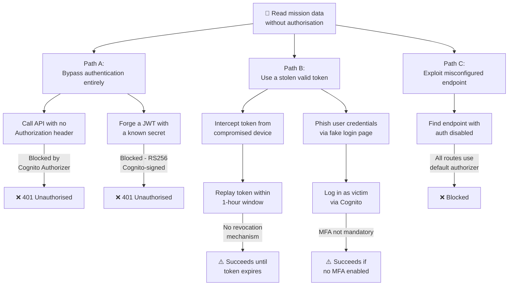
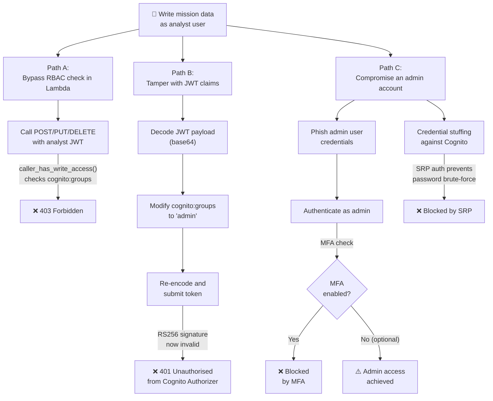
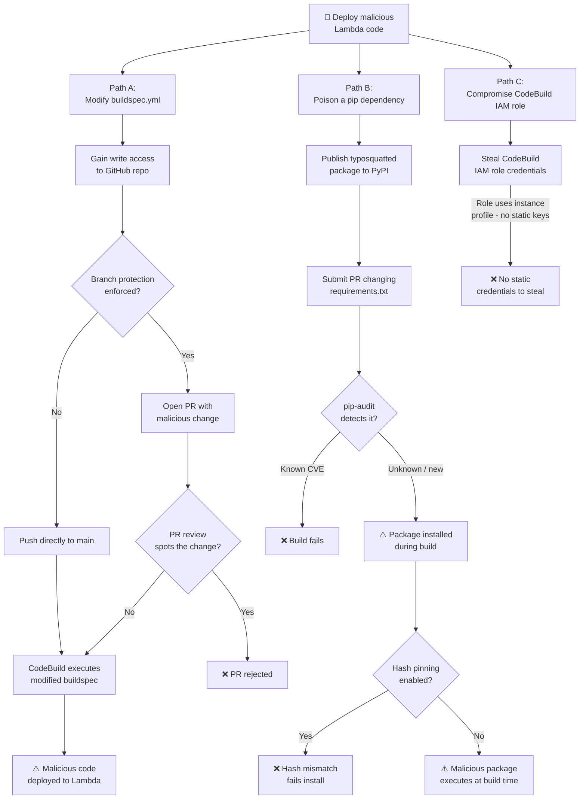
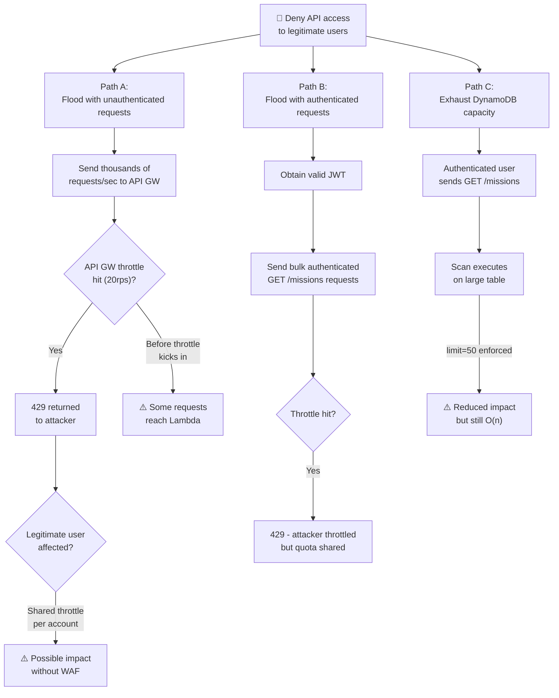
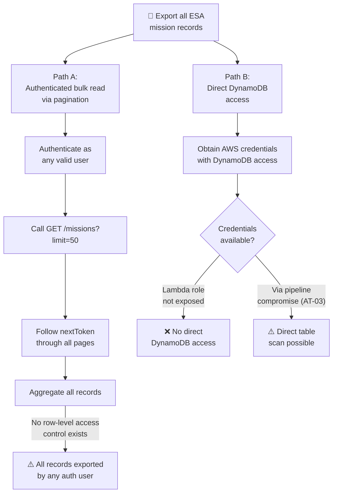

# STRIDE Analysis — 05: Attack Paths

Attack trees show how an attacker could achieve a goal, broken down into steps.
Each tree maps to one or more abuse cases from `04-abuse-cases.md`.

---

## AT-01: Gain Unauthorised Read Access to Mission Data

**Goal:** Read ESA mission records without a valid account  
**Related abuse cases:** AC-02, AC-01

---

## AT-02: Escalate from Analyst to Admin Privileges

**Goal:** Perform write operations as a read-only analyst  
**Related abuse cases:** AC-03, AC-04

---

## AT-03: Inject Malicious Code via the Build Pipeline

**Goal:** Deploy backdoored Lambda code to production  
**Related abuse cases:** AC-07, AC-08

---

## AT-04: Cause Denial of Service

**Goal:** Make the API unavailable to legitimate users  
**Related abuse cases:** AC-06

---

## AT-05: Exfiltrate Mission Intelligence

**Goal:** Extract all ESA mission data  
**Related abuse cases:** AC-09, AC-01

---

## Attack Path Risk Summary

| Tree | Goal | Easiest Path | Difficulty | Current Status |
|---|---|---|---|---|
| AT-01 | Unauthorised read | Stolen token replay | Medium | ⚠️ Partial — no revocation |
| AT-02 | Analyst → Admin EoP | Phish admin + no MFA | Medium | ⚠️ MFA is optional |
| AT-03 | Backdoor Lambda | Modify buildspec.yml | Hard | ⚠️ Branch protection not enforced |
| AT-04 | DoS | Authenticated request flood | Easy | ⚠️ No WAF |
| AT-05 | Data exfiltration | Authenticated pagination | Easy | ⚠️ No row-level access control |
