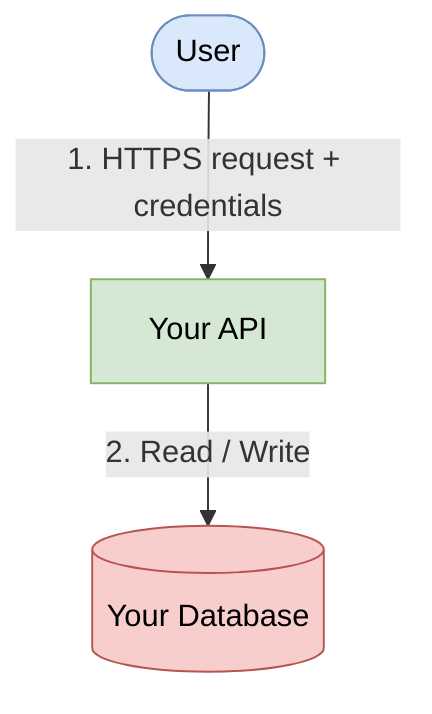

# Lab: STRIDE Threat Modelling

## Overview

In this lab you will perform a full STRIDE threat model on a system you have built or are
currently working on. You will follow the same 8-step process used in the
**ESA Mission Registry** worked example (`demos/stride/stride/`). Use those documents as a
reference at every step.

**Estimated time:** 2.5 – 3 hours  
**Format:** Individual or pairs  
**Deliverable:** A folder of markdown documents matching the structure below

---

## Prerequisites

- You have reviewed the ESA Mission Registry demo (`demos/stride/`)
- You have read through all 8 STRIDE artefacts in `demos/stride/stride/`
- You have a system in mind to analyse (see *Choosing Your System* below)
- Mermaid preview enabled in VS Code (`Markdown Preview Mermaid Support` extension)

---

## Choosing Your System

Pick a project you have built or are currently working on. It should have:

- At least one **authentication mechanism** (login, API key, OAuth, etc.)
- At least one **data store** (database, S3 bucket, file system, etc.)
- At least two distinct **user roles or caller types**
- At least one **external integration** (third-party API, message queue, CI/CD pipeline, etc.)

If your project is very large, scope it down to a single service or feature area — for example,
just the authentication flow, or just the data ingestion pipeline. A tightly scoped model is
more useful than a shallow one covering everything.

---

## Deliverable Structure

Create the following folder and files. Replace `<your-system>` with a short name for your project.

```
labs/stride/<your-system>/
├── 00-scope-and-goals.md
├── 01-system-model.md
├── 02-trust-boundaries.md
├── 03-stride-analysis.md
├── 04-abuse-cases.md
├── 05-attack-paths.md
├── 06-threat-prioritisation.md
└── 07-mitigations-and-validation.md
```

---

## Step-by-Step Instructions

---

### Step 1 — Scope and Goals `00-scope-and-goals.md`
⏱ *15 minutes*

Define what you are modelling and why.

**You must include:**
- [ ] A short description of the application (2–4 sentences)
- [ ] An **In Scope** table — list every component you will model
- [ ] An **Out of Scope** table — list what you are explicitly excluding and why
- [ ] CIA triad objectives applied to your domain data (what does confidentiality, integrity, and availability mean *for your system*?)
- [ ] At least 3 assumptions you are making about the environment

> 📖 Reference: `demos/stride/stride/00-scope-and-goals.md`

---

### Step 2 — System Model `01-system-model.md`
⏱ *25 minutes*

Draw the system using **Mermaid flowcharts**.

**You must include:**
- [ ] A **Level 0 context diagram** — your system as a single box with external actors
- [ ] A **Level 1 DFD** — expanded to show each component, data flows numbered, data stores shown
- [ ] A short description of each numbered data flow (what data moves, in what direction, and why)

**Tips:**
- Use `flowchart TD` or `flowchart LR`
- Label every arrow with what data it carries
- Use `[(name)]` syntax for data stores, `([name])` for external actors

**Starter template:**


> 📖 Reference: `demos/stride/stride/01-system-model.md`

---

### Step 3 — Trust Boundaries `02-trust-boundaries.md`
⏱ *15 minutes*

Identify where data crosses from one trust zone to another.

**You must include:**
- [ ] At least **4 trust boundaries** in a table (ID · Name · What crosses it · Why it matters)
- [ ] An annotated version of your Level 1 DFD with boundaries shown as dashed lines or boxes
- [ ] For each boundary, state the **implicit trust assumption** being made

> A trust boundary exists wherever:
> - Data moves between the public internet and your system
> - Two services run under different IAM roles, service accounts, or auth contexts
> - Code from an external source (package, pipeline, webhook) is executed
> - A human operator interacts with the running system

> 📖 Reference: `demos/stride/stride/02-trust-boundaries.md`

---

### Step 4 — STRIDE Analysis `03-stride-analysis.md`
⏱ *35 minutes*

Apply all 6 STRIDE categories to each trust boundary.

**You must include:**
- [ ] A threat table for **each trust boundary** with columns:
  `Threat ID | STRIDE Category | Threat Description | Affected Component | Existing Control (if any)`
- [ ] At least **2 threats per STRIDE category** across the whole model
- [ ] A justification wherever a STRIDE category has no applicable threat at a given boundary

| STRIDE | Question to ask at each boundary |
|--------|----------------------------------|
| **S**poofing | Can an attacker pretend to be a legitimate caller or component? |
| **T**ampering | Can an attacker modify data in transit or at rest? |
| **R**epudiation | Can a user deny having performed an action? |
| **I**nformation Disclosure | Can an attacker read data they should not? |
| **D**enial of Service | Can an attacker degrade or stop the service? |
| **E**levation of Privilege | Can an attacker gain more access than they should have? |

> 📖 Reference: `demos/stride/stride/03-stride-analysis.md`

---

### Step 5 — Abuse Cases `04-abuse-cases.md`
⏱ *20 minutes*

Rewrite your most significant threats as **misuse stories**.

**You must include:**
- [ ] At least **6 abuse cases** — one per STRIDE category minimum
- [ ] Each written in the format:
  > *"As a [attacker type], I want to [action], so that I can [goal]."*
- [ ] Acceptance criteria written as **negative tests** — what must NOT be possible

**Attacker types to consider:**
- Unauthenticated external attacker
- Authenticated low-privilege user
- Compromised internal service (e.g. a microservice with stolen credentials)
- Malicious insider with repository access
- Automated scanner or bot

> 📖 Reference: `demos/stride/stride/04-abuse-cases.md`

---

### Step 6 — Attack Paths `05-attack-paths.md`
⏱ *20 minutes*

Model how an attacker would chain steps together to reach a goal.

**You must include:**
- [ ] At least **3 attack trees** using Mermaid flowcharts
- [ ] Each tree must have a **goal node** at the top and at least 2 levels of sub-steps
- [ ] Each leaf node labelled as **feasible**, **difficult**, or **mitigated**

**Suggested goals to model:**
- Gain write access to data as an unauthenticated user
- Exfiltrate all records from the primary data store
- Deploy malicious code via the CI/CD pipeline

> 📖 Reference: `demos/stride/stride/05-attack-paths.md`

---

### Step 7 — Prioritise Threats `06-threat-prioritisation.md`
⏱ *20 minutes*

Score every threat from Step 4 using the **DREAD model**.

| Dimension | 1 — Low | 2 — Medium | 3 — High |
|-----------|---------|------------|----------|
| **D**amage | Minimal data exposure | Partial data loss or corruption | Full compromise or regulatory breach |
| **R**eproducibility | Requires specific conditions | Reliably reproducible with effort | Trivially reproducible |
| **E**xploitability | Expert attacker + special access | Some skill required | Script kiddie / automated tool |
| **A**ffected users | Single user | Subset of users | All users |
| **D**iscoverability | Internal knowledge required | Detectable by probing | Obvious from public docs or scanning |

| Score | Band | Action |
|-------|------|--------|
| 13–15 | 🔴 Critical | Fix before next release |
| 10–12 | 🟠 High | Fix within current sprint |
| 7–9 | 🟡 Medium | Schedule in next sprint |
| ≤ 6 | 🟢 Low | Accept or fix when convenient |

**You must include:**
- [ ] A scored table for all threats
- [ ] A **top 5 threats** summary with justification for each ranking
- [ ] At least one threat you are proposing to **accept**, with a written rationale

> 📖 Reference: `demos/stride/stride/06-threat-prioritisation.md`

---

### Step 8 — Mitigations and Validation `07-mitigations-and-validation.md`
⏱ *20 minutes*

For every **High or Critical** threat, define a mitigation and explain how you would validate it.

**You must include:**
- [ ] A mitigation table with columns:
  `Threat ID | Mitigation | Where Implemented | How to Validate`
- [ ] At least **one mitigation per STRIDE category**
- [ ] A **gap analysis** — threats with no current mitigation and what you would build next
- [ ] A **residual risk register** — threats you are accepting, with owner and review date

**Validation methods to consider:**
- Automated unit or integration test (name the test file and function)
- Manual `curl` / Postman request with expected HTTP status code
- AWS CLI or Console check with expected output
- SAST / dependency scan result
- Infrastructure-as-code property reference

> 📖 Reference: `demos/stride/stride/07-mitigations-and-validation.md`

---

## Peer Review Checklist

Once you have completed your documents, swap with a partner and review their work using this
checklist. Add your comments directly below each section heading in their documents.

### System Model
- [ ] Are all components from the scope document visible in the DFD?
- [ ] Are all data flows labelled with what data they carry?
- [ ] Are data stores clearly distinguished from processes and actors?

### Trust Boundaries
- [ ] Is every internet-facing entry point covered by a boundary?
- [ ] Does every boundary have an implicit trust assumption stated?
- [ ] Are there any missing boundaries? (suggest at least one if so)

### STRIDE Analysis
- [ ] Are all 6 categories covered at the highest-risk boundary?
- [ ] Can you identify at least one threat the author missed?

### Abuse Cases
- [ ] Are they written from the attacker's perspective?
- [ ] Are the acceptance criteria specific enough to test?

### Prioritisation
- [ ] Do you agree with the top 5 ranking?
- [ ] Is there a threat you would score significantly differently? Why?

### Mitigations
- [ ] Is every Critical and High threat mitigated?
- [ ] Are the validation steps concrete enough to actually run?

---

## Submission

Place your completed documents in:

```
labs/stride/<your-system>/
```

Commit and push to your branch. Your work will be reviewed in the group debrief session.

---

## Debrief Discussion Points

Come prepared to discuss:

1. Which STRIDE category produced the most threats for your system, and why?
2. What was your highest-scoring DREAD threat — did the score surprise you?
3. Did the peer review surface anything you had missed?
4. Which single mitigation would give the greatest security improvement for the least effort?
5. How would you integrate threat modelling into your team's regular development workflow?
